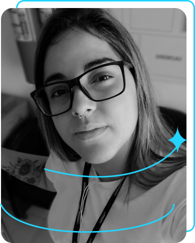

# 🚀 Portfólio Profissional

  

  <strong>Olá! Bem-vindo ao meu projeto de portfólio.</strong>

## 📝 Descrição
Site criado com o intuito de mostrar meus estudos, com as páginas Home, Sobre Mim, Currículo e Contato. 

### 🖥️ Pré-visualização do Projeto:

  

## 🛠️ Ferramentas Utilizadas
* **HTML5** e **CSS3**
* **Flexbox** (Responsividade)

## 🔗 Links Oficiais
* **🌐 Site Online (Vercel):** [Acesse meu projeto aqui](https://portfolio-74hdswoky-vivianearaujo.vercel.app/)
* **🟦 LinkedIn Profissional:** [Conecte-se comigo no LinkedIn](https://www.linkedin.com/in/viviane-santos-b63986106/)

---

## 👩‍💻 Feito por:
### **Viviane Santos**
*Estudante de Análise e Desenvolvimento de Sistemas | Foco em Back-end (Python & FastAPI)*
